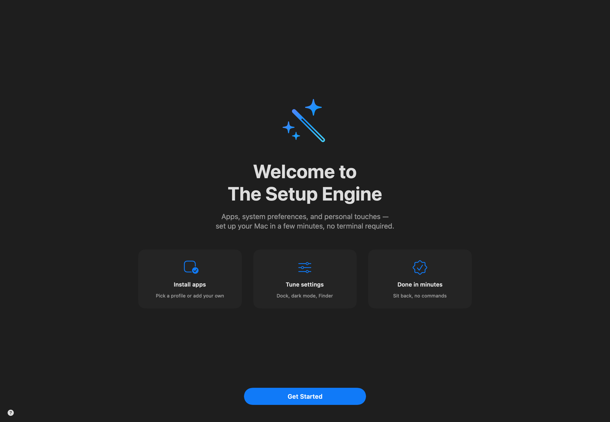
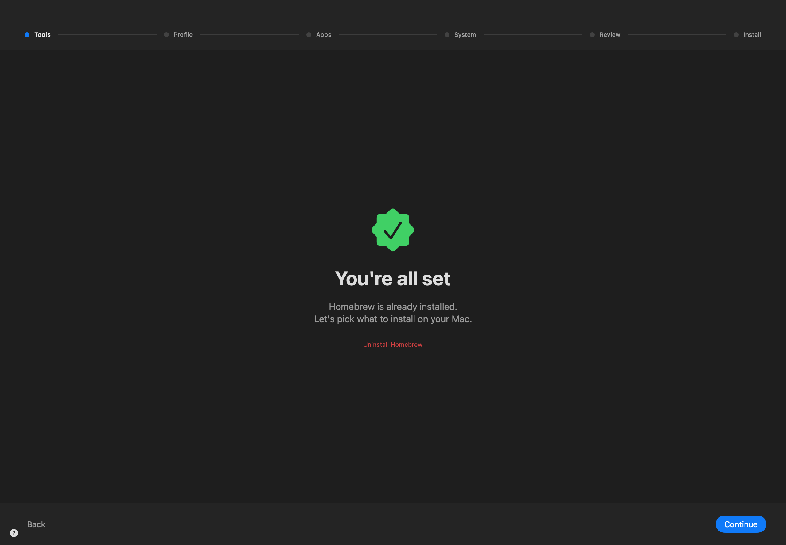
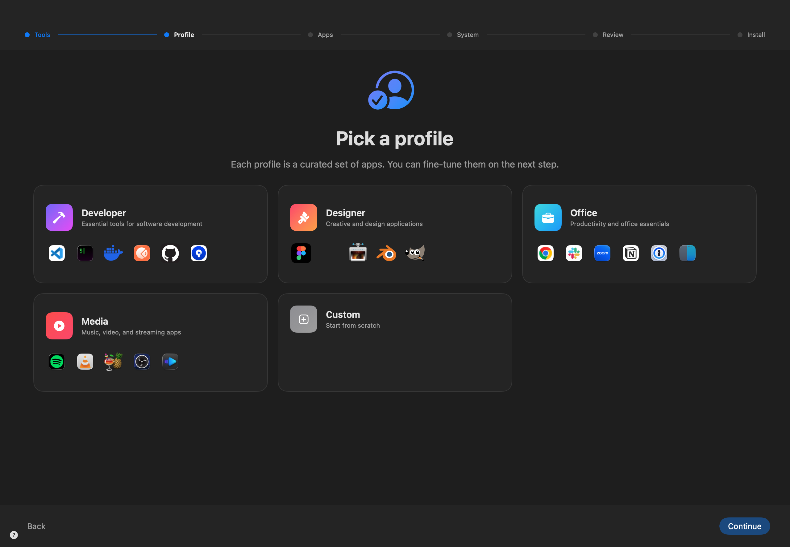
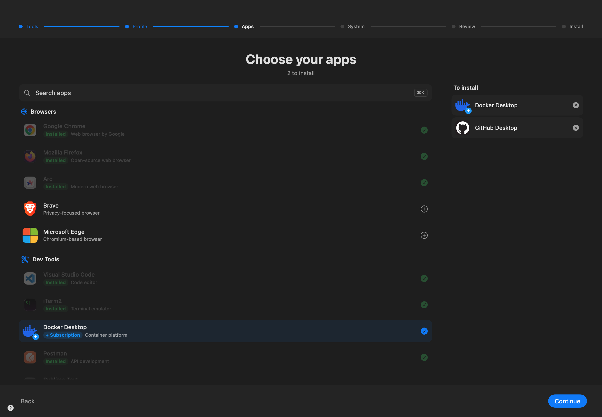
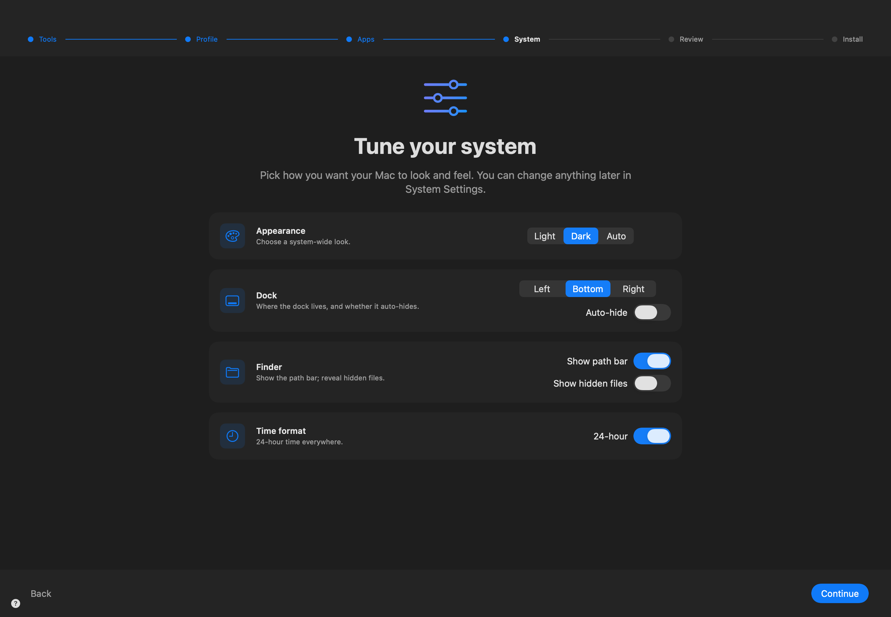
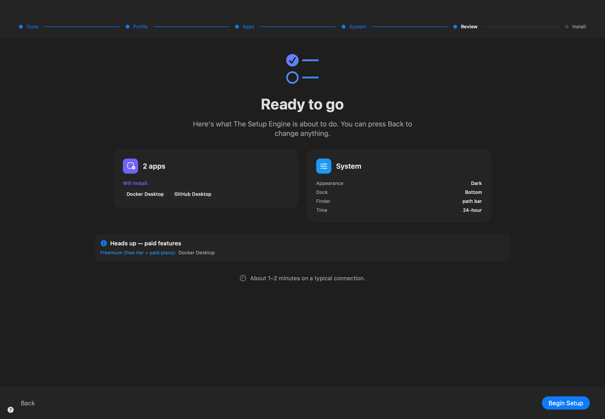

# The Setup Engine

A guided macOS setup workflow built with SwiftUI. Installs apps via Homebrew Cask and configures system preferences without ever touching Terminal.



## Why

Some days I wipe my Mac multiple times. Others, not so much. Either way, I kept finding myself doing the same thing over and over — downloading the same apps I use daily, toggling the same preferences. I wanted a Mac version of Ninite.

What started as a shell script is now this SwiftUI app that walks anyone through the same six steps without ever touching a terminal: Tools, Profile, Apps, System, Review, Install.

If you're setting up a brand new Mac — or wipe yours as often as I do — I hope it cuts the mundane out of it.

**Requirements:** macOS 14 (Sonoma) or later, Apple Silicon (arm64).

## How to use

### 1. Tools — install or detect Homebrew



If Homebrew is missing, hit **Install Homebrew** and the app handles it via `osascript with administrator privileges` — you'll get a single password prompt and a live progress bar. If it's already there, the app says so and skips ahead.

### 2. Profile — pick a starting set



Five curated profiles: **Developer**, **Designer**, **Office**, **Media**, or **Custom** (start from scratch). Each card previews the apps it'll bring in. Nothing's installed yet — this is just a starting point.

### 3. Apps — fine-tune the list



The full catalogue, grouped by category. Already-installed apps are greyed out with a green check (the app reads `/Applications` and `~/Applications`). Apps in your queue go to the **To install** rail on the right. Paid/freemium apps get a small badge so you know what you're committing to. **⌘K** opens a quick-search overlay from anywhere.

### 4. System — tune preferences



Dock position + auto-hide, system appearance (Light / Dark / Auto), Finder path bar + hidden files, 24-hour time. Everything here is a `defaults write` + `killall Dock`/`killall Finder` under the hood — non-destructive and trivially reversible from System Settings.

### 5. Review — confirm everything



A summary of what's about to happen — apps to install, settings to change, and a heads-up if anything in the queue is paid/freemium. Hit **Begin Setup** to actually run it, or **Back** to change anything.

### 6. Install

Staged progress with a clean "what's happening now" tile. No raw terminal output — that goes to a log file you can pull up via **File → Collect Diagnostic Logs… (⌘⇧L)**.

## Diagnostics

The floating **?** button (bottom-left of every screen) and the **File** menu both expose:

- **Collect Diagnostic Logs… (⌘⇧L)** — bundles the three log files into one timestamped `.txt` and reveals it in Finder.
- **Reveal Logs in Finder** — opens the logs directory.
- **Save Window Snapshot to Desktop (⌘⇧S)** — captures the current window as a PNG. (How the screenshots in this README were made.)

Three logs exist after a setup run:

| Path | Contents |
|---|---|
| `~/Library/Application Support/TheSetupEngine/Logs/setup-engine.log` | App-level structured log (categories: homebrew, install, settings, ui) |
| `/tmp/the_setup_engine_admin.log` | Output of any `osascript with administrator privileges` invocations |
| `/tmp/the_setup_engine_install.log` | Per-cask `brew install` stdout/stderr |

## Build & run

```bash
git clone https://github.com/jamieal/The-Setup-Engine.git
cd "The-Setup-Engine"
open "The Setup Engine.xcodeproj"
```

Then ⌘R in Xcode. The Debug build adds a hidden Debug menu (toggle Homebrew "not installed", simulate failures, jump between steps).

To build a Release `.dmg` for sharing:

```bash
./scripts/release.sh
# → build/The Setup Engine.dmg
```

If you have an Apple Developer account, set `DEVELOPMENT_TEAM`, `APPLE_ID`, and `NOTARY_PASSWORD` env vars and the same script will sign + notarize.

## Architecture

Single-target SwiftUI app. No Swift Package dependencies.

- **`SetupCoordinator`** — `ObservableObject` state machine. One step enum, one navigation method, all state lives here.
- **`SetupContainerView`** — header (progress track), body (current step), footer (Back / Continue), ⌘K overlay, floating ? button.
- **Step views** — `WelcomeStep`, `HomebrewStep`, `ProfileStep`, `AppsStep`, `SystemStep`, `ReviewStep`, `InstallStep`, `DoneStep`.
- **`ShellRunner`** — async shell exec with non-blocking termination handling. `runWithAdmin` uses `osascript … with administrator privileges` for the Homebrew install.
- **`AppLog`** — lightweight logger; mirrors to `~/Library/Application Support/TheSetupEngine/Logs/`.
- **`AppVersion`** — single source of truth for version strings, read from Info.plist.
- **`WindowSnapshot`** — in-app self-screenshot via `NSView.cacheDisplay`, no Screen Recording permission required.
- **`DebugState`** — runtime debug overrides (`#if DEBUG` gated). Toggleable from a menu bar item; also reads `TSE_FORCE_NO_BREW=1` and friends from the environment.

## Safety notes

The app runs a few commands as root via `osascript with administrator privileges`. Every privileged command:

- Hardcodes paths (`/opt/homebrew`) — no `rm -rf "$VAR/*"` patterns
- Validates `$USER_NAME` and `$PREFIX` before any destructive operation
- Logs everything it does to `/tmp/the_setup_engine_admin.log`

The system preferences step uses `defaults write` and `killall Dock` / `killall Finder` — all non-destructive and reversible from System Settings.

## Status

- **Apple Silicon only** (arm64). Universal binary support is on the to-do list.
- **macOS 14 (Sonoma)+**.
- Built and signed ad-hoc. No notarization yet — that requires an Apple Developer Program membership.
- Single-developer side project. Not a polished product. PRs and issues welcome.

## License

MIT.
